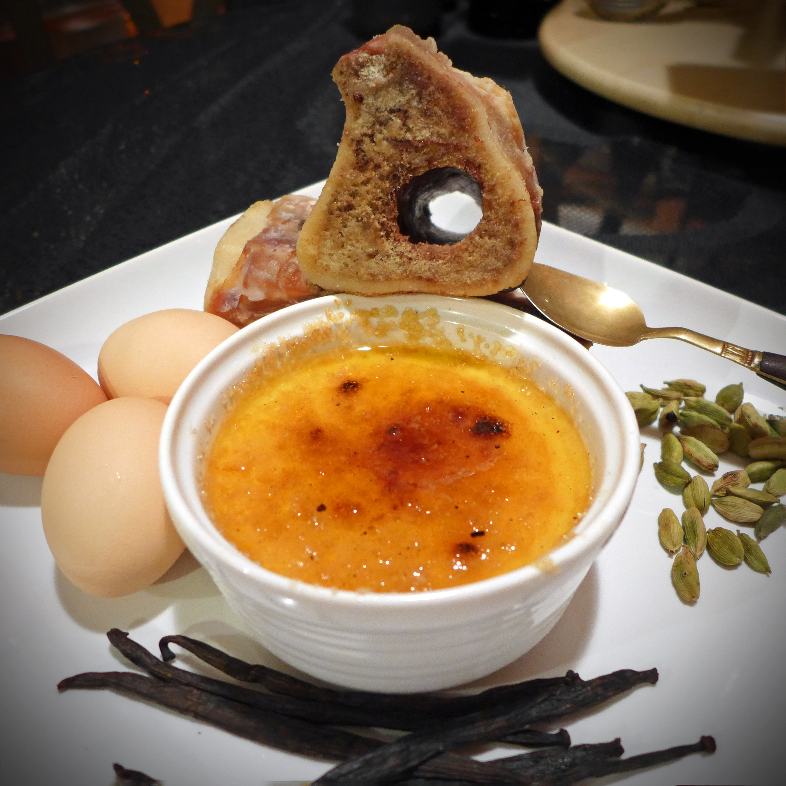
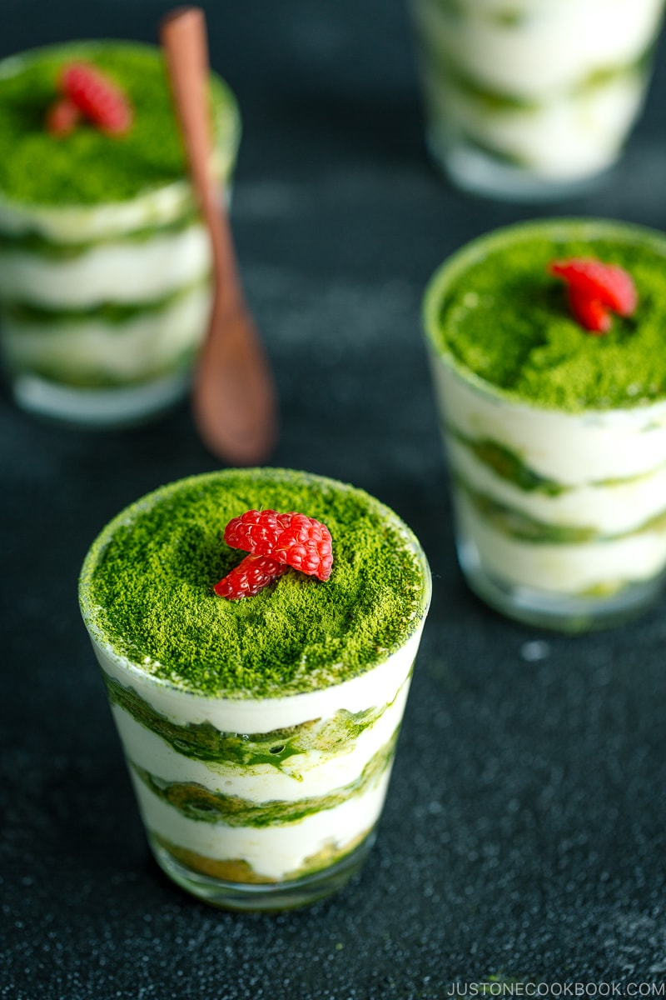
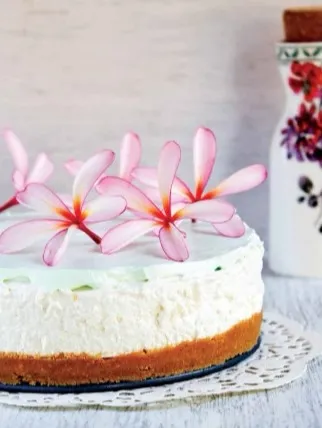
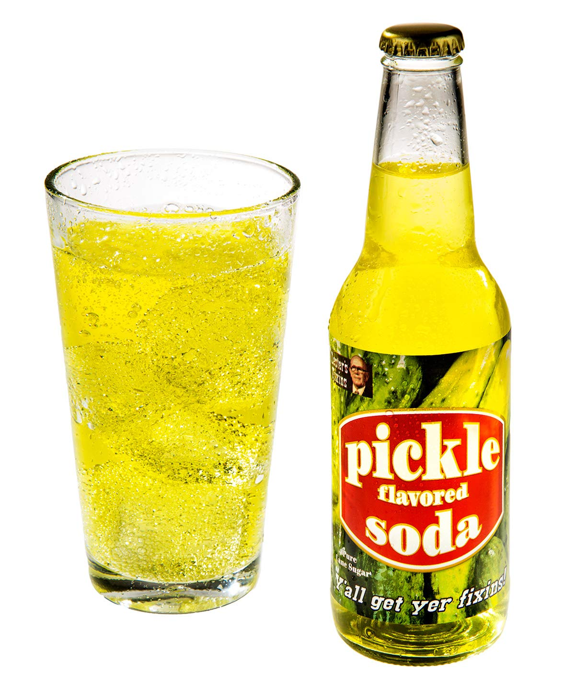

## Menu

[Desserts](#desserts) | [Beverages](#beverages)

## Desserts
| Food Name                  | Description | Image | Price |
|:---------------------------|:------------|:------|:------|
| *Bone Marrow Crème Brulée* | Rich custard base topped with a layered of hardened caramelized sugar. Combined with bone marrow to amplifie the richness of the dish. | | ฿299 |
| *Matcha Tiramisu* | The classic Italian dessert twisted with matcha green tea powder to give vibrant green color and the taste of Japan. |  | ฿59 |
| *Spicy Chocolate Cake with Chilies* | A cake that combined chocolate and chillies to create a unique flavor. |  | ฿249 |
| *White Chocolate and Wasabi Cheesecake* | A cheesecake shaped up with a crushed biscuit base, topped off with cream cheese, wasabi, and a white chocolate filling. | | ฿149 |

## Beverages
| Beverage name     | Description | Image | Price |
|:------------------|:------------|:------|:------|
| *Pickle Soda Pop* | Soda mixed with pickle juice, has a tangy and salty flavor. |  | ฿25 |