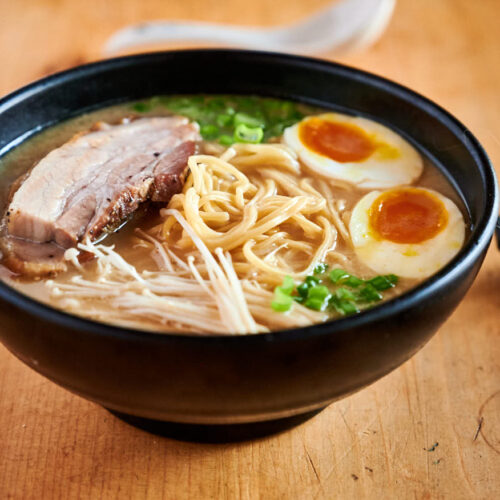
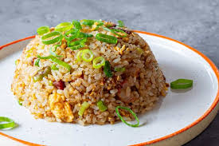

## Menu

[Noodles](#noodles) | [Rice Dishes](#rice-dishes) | [Desserts](#desserts) | [Beverages](#beverages)

## Noodles

| Food Name              | Description         | Image          | Price  |
|:-----------------------|:--------------------|:---------------|-------:|
| *Lo Mein*              | A popular Chinese stir-fried noodle dish, where soft wheat noodles are tossed with a savory sauce made from soy sauce, garlic, and ginger. It’s often combined with vegetables, proteins like chicken, beef, or shrimp, and finished with a drizzle of sesame oil.         |  | ฿60  |
| *Meeshay*              | A traditional Burmese dish consisting of rice noodles served with a rich, flavorful pork or chicken sauce. It's typically garnished with fresh herbs, bean sprouts, and pickled vegetables.   |  | ฿45 |
| *Ramen*                |  A Japanese noodle soup consisting of Chinese-style wheat noodles served in a flavorful broth, typically soy sauce or miso-based, and topped with ingredients such as sliced pork, soft-boiled eggs, nori (seaweed), and green onions.         |  | ฿50  |
| *Spaghetti*            | A classic Italian pasta dish featuring noodles topped with a savory tomato sauce, often enriched with garlic, olive oil, and herbs. Commonly served with grated Parmesan cheese and sometimes with meatballs or a Bolognese sauce.       |  | ฿80 |

## Rice Dishes

Food Name|Description|Image|Price
---|---|---|---
*Omurice*|A classic Japanese dish that consists of ketchup-flavored fried rice wrapped in a thin omelette. Maid cafes often decorate the omelette with cute ketchup designs or messages to add a touch of charm.||฿12.99
*Katsu Curry*|A popular dish in Japan featuring crispy breaded pork cutlet (tonkatsu) served on a bed of rice with a rich and savory curry sauce. Maid cafes may serve this dish with the curry sauce shaped into adorable patterns.||฿14.99
*Hayashi Rice*|A beef and mushroom stew served over rice, typically flavored with a demi-glace sauce. Maid cafes might present this dish with the stew poured over the rice in the shape of a heart or other cute designs.||฿13.50
*Yakimeshi*|A Japanese-style fried rice dish cooked with various ingredients such as vegetables, meat, and sometimes seafood. Maid cafes may serve Yakimeshi with a cute presentation, such as shaping the rice into hearts or other playful designs, adding a touch of whimsy to this flavorful and comforting dish.||฿11.99

## Desserts
| Food Name                  | Description | Image | Price |
|:---------------------------|:------------|:------|:------|
| *Bone Marrow Crème Brulée* | Rich custard base topped with a layered of hardened caramelized sugar. Combined with bone marrow to amplifie the richness of the dish. | | ฿299 |
| *Matcha Tiramisu* | The classic Italian dessert twisted with matcha green tea powder to give vibrant green color and the taste of Japan. |  | ฿59 |
| *Spicy Chocolate Cake with Chilies* | A cake that combined chocolate and chillies to create a unique flavor. |  | ฿249 |
| *White Chocolate and Wasabi Cheesecake* | A cheesecake shaped up with a crushed biscuit base, topped off with cream cheese, wasabi, and a white chocolate filling. | | ฿149 |

## Beverages

Beverage Name|Description|Image|Price
---|---|---|---
*Chocolate Cocoa* | A warm and comforting beverage made from cocoa powder, milk, and sugar. It can be topped with whipped cream or marshmallows. ||฿30|
*Matcha Latte*|A creamy and frothy matcha latte made with high-quality matcha powder and steamed milk, topped with cute latte art.||฿5.99|
*Pickle Soda Pop*|Soda mixed with pickle juice, has a tangy and salty flavor.||฿25|